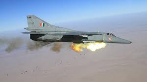

<html>

<title>The Indian Airforce</title>
<h1>Kargil hero MiG-27 will take to sky one last time Friday, IAF squadron strength to go down</h1>
<body>

New Delhi: The Indian Air Force’s strength is set to come down to just 28 squadrons of fighters as against a sanctioned 42, with the last of the remaining MiG-27 aircraft, heroes of the Kargil battle, flying their final sortie Friday in Jodhpur before retiring from service.
The No. 29 Squadron, known as the ‘Scorpios’, will be ‘numberplated’ (placed in suspension) until it can be re-operationalised with new aircraft and manpower.
<i>The aircraft has a glorious history, and this is the last of the MiG-23/MiG-27 class variable sweep (swing wing) Russian-origin aircraft operating in the world</i> 
<strong>Commodore Philip Thomas, Air Officer Commanding of the Jodhpur air base, told The Print.</strong>
The Jodhpur base had two squadrons of the upgraded ‘Flogger’ MiG-27s — No. 10 and No. 29, of which the former was retired last year.
The <abbr title="INDIAN AIRFORCE">IAF</abbr> was founded in 1917

</body>
<nav>
  <a href="hello.html">loveme</a> |
  <a href="loveme.html">hello</a>
</nav>
</html>
